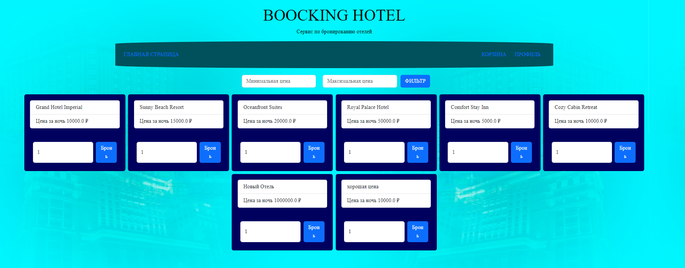
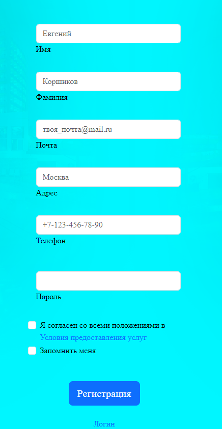
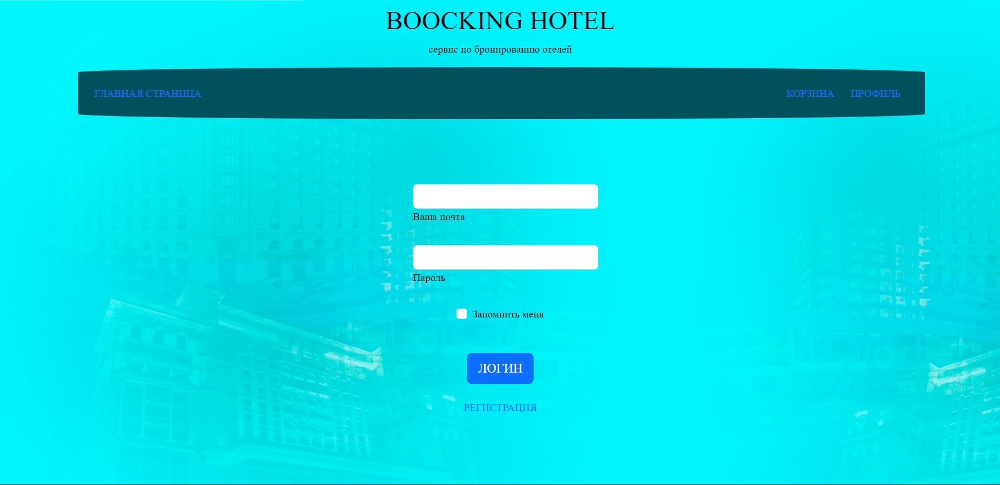
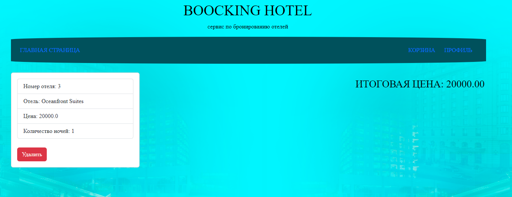
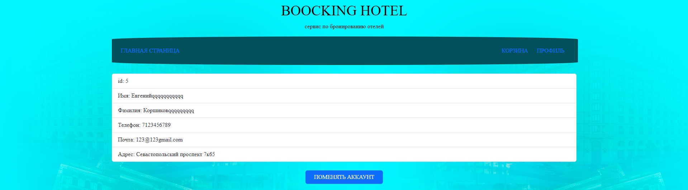

# FastAPI Project - Hotels

## Обзор проекта

Этот проект представляет собой веб-приложение для управления гостиницами, созданное на FastAPI. Приложение предоставляет интерфейс для добавления и управления данными о гостиницах, а также интерфейс для пользователей, позволяющий просматривать и взаимодействовать с этими данными. В проекте используется база данных SQLite для хранения информации и Alembic для управления миграциями базы данных.

## Основные возможности

- Управление данными о гостиницах (добавление, обновление, удаление).
- Маршруты для взаимодействия с данными через API.
- Интерфейс для пользователей на основе HTML-шаблонов.
- Использование Alembic для миграций базы данных.


## Установка и запуск

1. Клонируйте репозиторий:
   ```bash
   git clone https://github.com/nuggetpluto/UrbanDiplom_FastAPI.git
   ```

2. Установите зависимости:
   ```bash
   pip install -r requirements.txt
   ```

3. Выполните миграции базы данных с помощью Alembic:
   ```bash
   alembic upgrade head
   ```

4. Запустите сервер:
   ```bash
   uvicorn main:app --reload
   ```

5. Откройте в браузере:
   ```
   http://127.0.0.1:8000
   ```

## Использование

### 1. Главная страница

На главной странице отображается общий список гостиниц с базовой информацией о каждой из них. Пользователь может просматривать доступные отели и переходить к деталям.



### 2. Регистрация и вход

- **Регистрация**: Форма для регистрации нового пользователя.  
  

- **Вход**: Страница для авторизации. После входа пользователь получает доступ к дополнительным функциям, таким как управление личным кабинетом и корзиной.  
  

### 3. Работа с корзиной

Интерфейс для добавления гостиниц в корзину. Пользователь может просмотреть список добавленных гостиниц, удалить их или продолжить оформление.



### 4. Личный кабинет пользователя

Личный кабинет включает информацию о профиле пользователя, список заказов и доступ к настройкам.



## Структура проекта

```
Hotels/
│
├── alembic/                   # Папка для миграций базы данных
├── alembic.ini                # Конфигурационный файл Alembic
├── create_db.py               # Скрипт для создания базы данных
├── database.py                # Подключение и настройки базы данных
├── main.py                    # Основной файл приложения с маршрутами
├── models.py                  # Модели данных для базы данных
├── project11.db               # База данных SQLite
├── requirements.txt           # Зависимости проекта
├── static/                    # Статические файлы (CSS, изображения)
└── templates/                 # HTML-шаблоны для страниц
```   